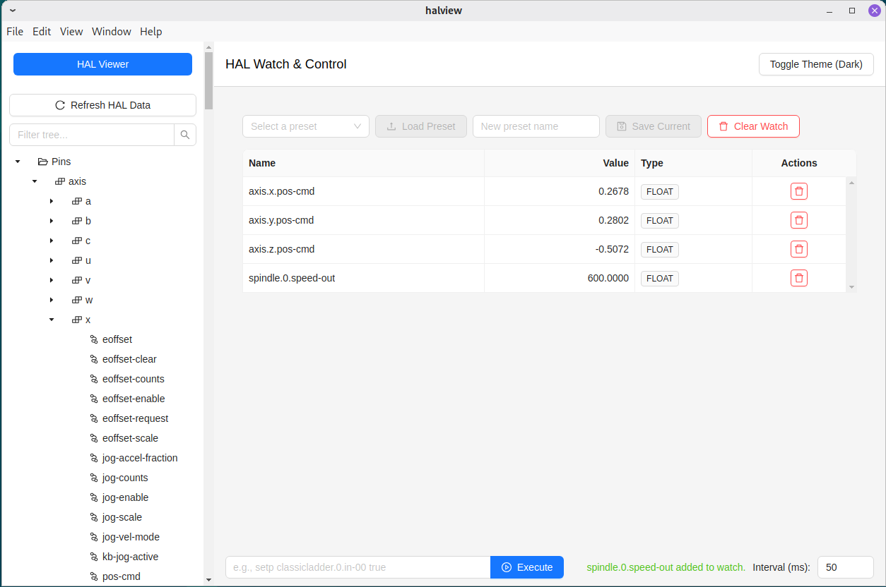
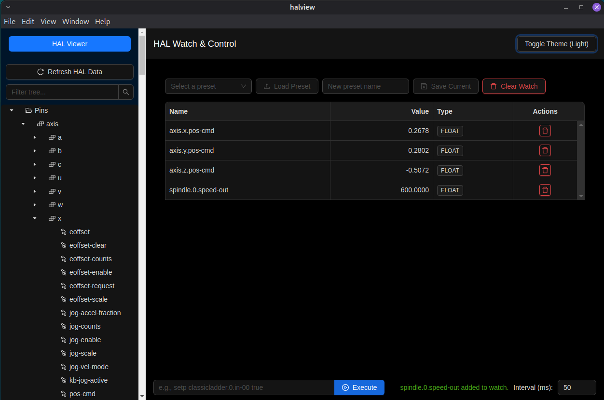

# HAL View - A @linuxcnc-node/hal Example

## About This Project

This is a **demonstration application (proof-of-concept)** created to explore and showcase the capabilities of the [`@linuxcnc-node/hal`](https://www.npmjs.com/package/@linuxcnc-node/hal) npm package. The primary goal was to replicate core functionalities of the existing `halshow` program (provided with LinuxCNC) using a modern technology stack: Electron, React, TypeScript, Vite, and the Ant Design UI library.

**Important:** This application is **not a fully polished product** and is **not intended to replace the original `halshow` program**. Instead, it serves as an experimental playground and an example of how one can interact with the LinuxCNC Hardware Abstraction Layer (HAL) from Node.js.

### Light Mode



### Dark Mode



While developing this replica, it became apparent that a modern approach could offer several enhancements over the classic `halshow` experience. This project implements some of those ideas.

## Core Replicated Functionality (`halshow` Parity)

- **HAL Item Browsing**: Displays HAL pins, parameters, and signals.
  - Tree view for navigating all HAL items.
- **Watch List**: Monitor values of selected pins, parameters, and signals in real time.
  - Set values for writable items directly in the watch list.
  - Shows data type information.
- **HAL Command Execution**: Interface for executing basic commands (`setp`, `sets`, `linkps`, `unlinkp`, `newsig`).

## New Features and Enhancements

- **Component-focused view**: Showing specific pins and parameters regarding specific component.
- **Switchable Light/Dark Theme**: Modern dark mode support via Ant Design theming.
- **Watch List Preset Management**: Save and load named watch list presets for quick restoration.
- **Item Detail Tooltips**: View basic information about HAL items on hover.
- **Autocomplete for HAL Commands**: Command input provides suggestions for HAL item names.

## Getting Started

1.  **Clone the repository.**
2.  **Install dependencies:**
    ```bash
    npm install
    # or
    yarn install
    ```
    _Ensure you have a build environment set up for compiling native Node.js modules and have the LinuxCNC development headers installed, as required by `@linuxcnc-node/hal`._
3.  **Run in development mode:**
    ```bash
    npm run dev
    # or
    yarn dev
    ```
4.  **Build the application for production:**
    ```bash
    npm run build
    # or
    yarn build
    ```
    (The build output will be in a `release/${version}` directory as a `halview-Linux-${version}.AppImage` file).
